# InfoQ 年度热榜真实文章扩展 E2E 测试报告

测试日期：2026-06-07
来源页面：[InfoQ 年度热榜](https://www.infoq.cn/hotlist?tag=year)
执行命令：`npm run e2e:extension:infoq`

## 结论

通过。Chromium 成功打开 InfoQ 年度热榜和 6 篇真实文章，PeopleLens Chrome 扩展完成真实正文粘贴分析、AI 请求拦截、人物卡片渲染、关系渲染、导出、保存、失败保留旧结果等流程。

AI 服务说明：本次未使用真实外部 API Key；浏览器正文、扩展页面、用户交互和网络请求路径是真实运行，AI 响应用确定性 mock 拦截，目的是稳定验证扩展流程和结构化结果渲染，不评价真实模型抽取质量。

## 选文标准

- 必须出现在当前 `https://www.infoq.cn/hotlist?tag=year` 可见年度热榜中。
- Chromium 能打开文章页并从真实 DOM 抽取至少 600 字正文。
- 正文抽取优先使用 Obsidian Web Clipper 同源思路的 `defuddle/node`，并保留 DOM fallback。
- 覆盖不同主题：AI 编程、模型发布、AI 领导者争议、机器人训练、GitHub/Microsoft 生态。
- 至少包含一个明确人物信号，且尽量包含公司、模型、产品名等非人物干扰。
- 优先选择人物关系或观点冲突清晰的文章，便于验证证据句和关系线索 UI。

## 热榜采样

1. [编程 Agent 可能是软件开发史上最昂贵的错误之一](https://www.infoq.cn/article/oDaj3oKLwc8MiprLcxhs)
2. [Anthropic 推出 Claude Platform on AWS](https://www.infoq.cn/article/mjFmXfhf29SA5UFhr2QV)
3. [Opus 4.8 刚发布，Redis 之父质疑跑分：DHH 盛赞的 GPT-5.5，正在动摇编码王座](https://www.infoq.cn/article/rCTXhK96Y3jiDG7N1is5)
4. [DeepSeek V4 重磅开源！首次打通华为 Ascend，也没丢掉英伟达，百万上下文夺回国产模型话语权](https://www.infoq.cn/article/wUUPEzvNajcaVN0k7HPF)
5. [把 UI 生成接进流水线：基于半监督评测体系的 UI 自动化生产实践](https://www.infoq.cn/article/ybKCXkQgfxf4J9GCUuJl)
6. [“一人公司”正在重做 AI 创业？极客部落首场 16 个 OPC 项目路演：AI 创业已从“卷模型”转向“卷闭环”](https://www.infoq.cn/article/7m4Os8IANbmWbDOc4wDj)
7. [买了卡不等于买到生产力：企业 Token 焦虑，逼出 AI Infra 新战场](https://www.infoq.cn/article/TLRAmZy8pPICVFVWmu6p)
8. [Kubernetes v1.36 发布：安全默认配置强化，AI 工作负载支持日趋成熟](https://www.infoq.cn/article/kNkrHGzRvA7r6pRtlGB5)
9. [ChatGPT 可以帮你理财了，但它也知道你的全部余额！用户：谢谢不用了](https://www.infoq.cn/article/0iIMdRwey2MQ7BHLfFj8)
10. [鼠标每动一下都在训练 AI，Meta 员工“造反”了：厕所、会议室都贴满抗议传单](https://www.infoq.cn/article/QU5sZKgumE0oGvoHrULa)
11. [前 CEO 被学生嘘“别吹 AI”，现 CEO 被追问“会不会被 AI 取代”：谷歌两代掌门人的 AI 信仰，同时被质疑](https://www.infoq.cn/article/Us2wfr7Wx3sdb1RGoDY6)
12. [超越 TurboQuant！OSCAR：面向真实 Serving 的 2-bit KV Cache 量化](https://www.infoq.cn/article/B36ZgoaReVDs3l05yw0z)
13. [GitHub 推出 MCP 服务器集成，全面扩展机密扫描功能](https://www.infoq.cn/article/Fz17LfX18bjZVBG31AIW)
14. [百度想明白了：旧供给到达极限了](https://www.infoq.cn/article/rDTKqBrlGD5R93NFDOI8)
15. [停止编码的那天，就是失去架构判断力的开始：一位 30 年架构师的 AI 生存指南](https://www.infoq.cn/article/zLaHwePKytptG102IscF)
16. [兼顾效率、成本与能力，百灵开源旗舰推理模型 Ring-2.6-1T](https://www.infoq.cn/article/rtbXo0YG1cQ0kFwd2ueK)
17. [对话罗剑岚：把机器人“部署”本身变成训练的一部分](https://www.infoq.cn/article/9qNdzFNpb66rcCfKhNFe)
18. [GitHub 面临生存之战！多位员工曝内部乱象：独立文化要没了，封杀 Claude Code 才能“活”](https://www.infoq.cn/article/VZ4KvkToY57zj0ycsdBF)
19. [当国产模型追上闭源旗舰，企业 AI 编程的真正障碍才浮出水面](https://www.infoq.cn/article/K7hpIOogPsLlPQz4lwXu)
20. [Anthropic 推出 MCP 隧道，供私有代理访问内部系统](https://www.infoq.cn/article/jvoDNDaa2bRzwrHQy7lT)
21. [王兴兴亲测后点赞！这家 AI 公司提前半年把“龙虾”能力带上车，还管住了 Token 黑洞](https://www.infoq.cn/article/2c2JX4m7VqPrFaP5cI6t)
22. [当 AI 助手进化为自主智能体：英伟达如何携手 SAP 重构企业级“信任逻辑”？](https://www.infoq.cn/article/wEexICwqpBc5TsScTyiB)
23. [JEP 533 加强 JDK 27 中 Java 结构化并发的异常处理](https://www.infoq.cn/article/8jh0UiNm7SdaKzprlXWq)

## 选择的 6 篇文章

| 热榜序号 | 文章 | 抽取字符数 | 抽取引擎 | 期望人物 | 选择理由 | 状态 |
| --- | --- | ---: | --- | --- | --- | --- |
| 1 | [编程 Agent 可能是软件开发史上最昂贵的错误之一](https://www.infoq.cn/article/oDaj3oKLwc8MiprLcxhs) | 5699 | defuddle | George Hotz、Andrej Karpathy | 年度热榜第 1；人物观点强，包含 AI Agent、模型、公司和人物的混合干扰。 | passed |
| 3 | [Opus 4.8 刚发布，Redis 之父质疑跑分：DHH 盛赞的 GPT-5.5，正在动摇编码王座](https://www.infoq.cn/article/rCTXhK96Y3jiDG7N1is5) | 8144 | defuddle | antirez、DHH | 模型发布、跑分争议和开发者人物并存，可检查产品/模型名不会被当成人物。 | passed |
| 4 | [DeepSeek V4 重磅开源！首次打通华为 Ascend，也没丢掉英伟达，百万上下文夺回国产模型话语权](https://www.infoq.cn/article/wUUPEzvNajcaVN0k7HPF) | 11037 | defuddle | 梁文锋 | 模型、芯片平台和企业名密集，用来验证 PeopleLens 对人物少、组织多文章的表现。 | passed |
| 11 | [前 CEO 被学生嘘“别吹 AI”，现 CEO 被追问“会不会被 AI 取代”：谷歌两代掌门人的 AI 信仰，同时被质疑](https://www.infoq.cn/article/Us2wfr7Wx3sdb1RGoDY6) | 17141 | defuddle | Sundar Pichai、Eric Schmidt、Demis Hassabis | 人物密度高，涉及现任/前任 CEO、AI 负责人和 Google 产品体系。 | passed |
| 17 | [对话罗剑岚：把机器人“部署”本身变成训练的一部分](https://www.infoq.cn/article/9qNdzFNpb66rcCfKhNFe) | 3715 | defuddle | 罗剑岚、华卫 | 访谈型文章，核心人物明确，能验证中文姓名、身份和证据句展示。 | passed |
| 18 | [GitHub 面临生存之战！多位员工曝内部乱象：独立文化要没了，封杀 Claude Code 才能“活”](https://www.infoq.cn/article/VZ4KvkToY57zj0ycsdBF) | 4530 | defuddle | Vlad Fedorov、Thomas Dohmke、Satya Nadella | 公司、竞品和多名高管/员工混合，适合测试人物关系和组织噪声。 | passed |

## 覆盖的扩展行为

- 真实 InfoQ 页面打开和截图。
- 从渲染后的页面 HTML 使用 `defuddle/node` 抽取真实正文。
- Chrome 扩展 side panel 打开、API Key 输入、标题/URL/正文输入。
- 点击“分析粘贴正文”后出现 `AI 分析中...`，触发按钮禁用。
- 分析期间编辑“来源 URL”，验证非相关输入仍可交互。
- AI mock 返回 PeopleLens 要求的 JSON 结构，扩展渲染人物卡片和关系线索。
- 验证请求体包含文章标题、来源 URL 和 `句子列表`。
- 导出 Markdown 下载文件名匹配 `人物演员表.md`。
- 保存人物后出现 `已保存`。
- 模拟 AI 失败后旧人物结果仍可见，导出按钮保持可用。

## 截图

### 1. 编程 Agent 可能是软件开发史上最昂贵的错误之一

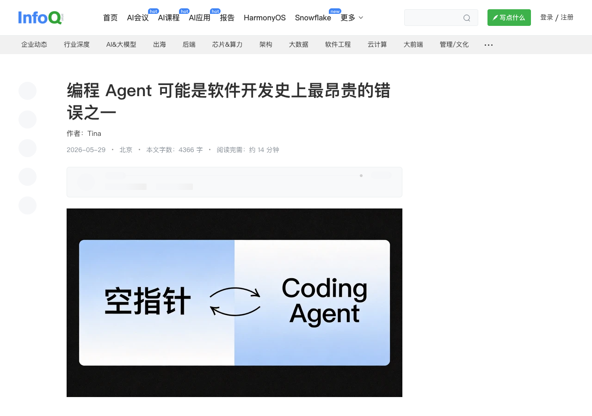

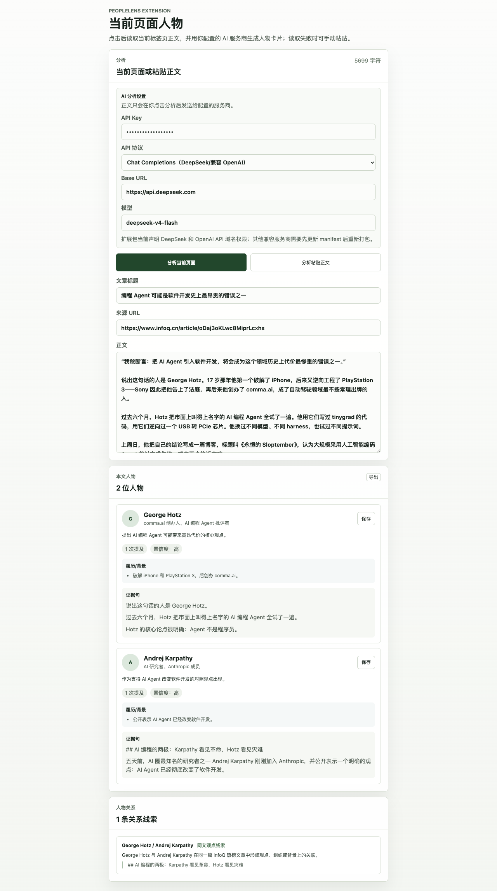

### 3. Opus 4.8 刚发布，Redis 之父质疑跑分：DHH 盛赞的 GPT-5.5，正在动摇编码王座

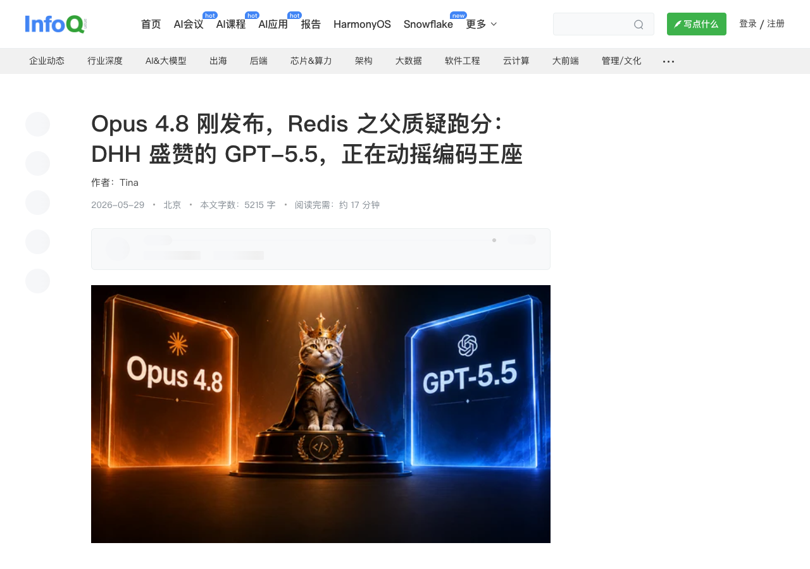

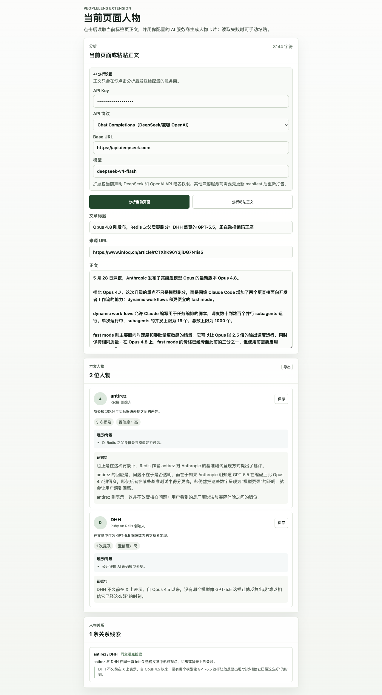

### 4. DeepSeek V4 重磅开源！首次打通华为 Ascend，也没丢掉英伟达，百万上下文夺回国产模型话语权

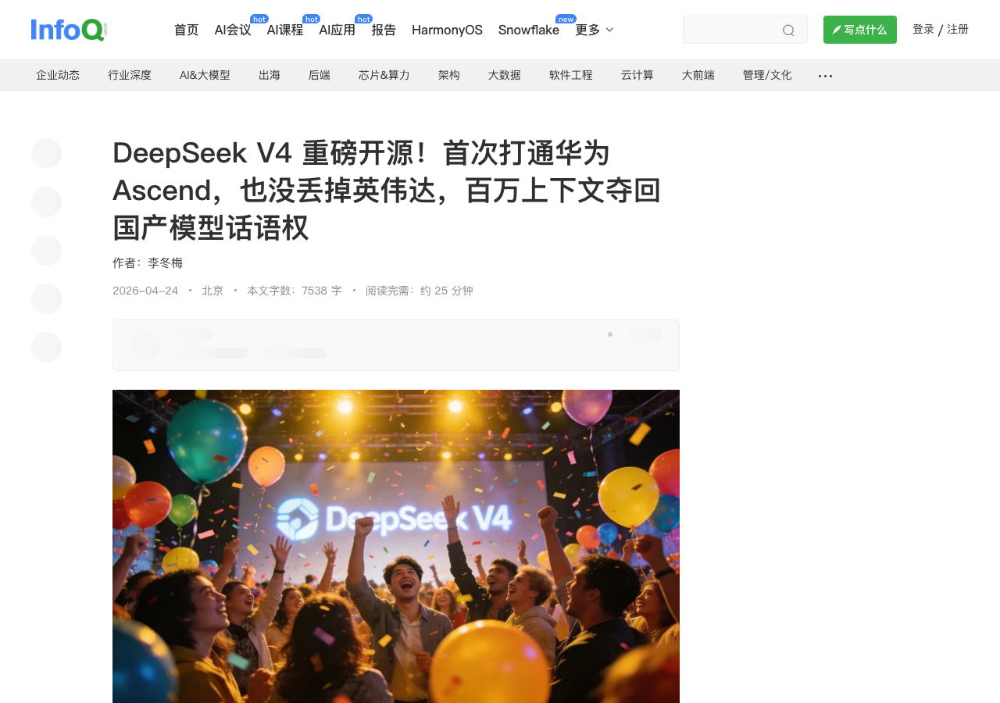

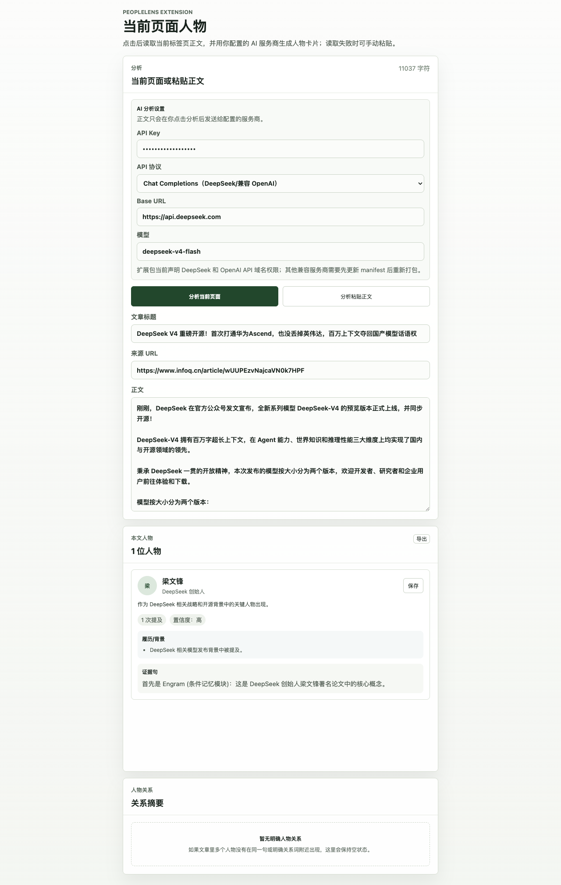

### 11. 前 CEO 被学生嘘“别吹 AI”，现 CEO 被追问“会不会被 AI 取代”：谷歌两代掌门人的 AI 信仰，同时被质疑

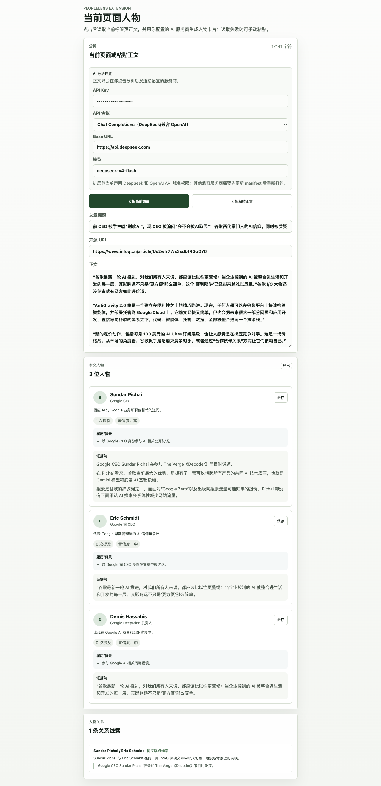

### 17. 对话罗剑岚：把机器人“部署”本身变成训练的一部分

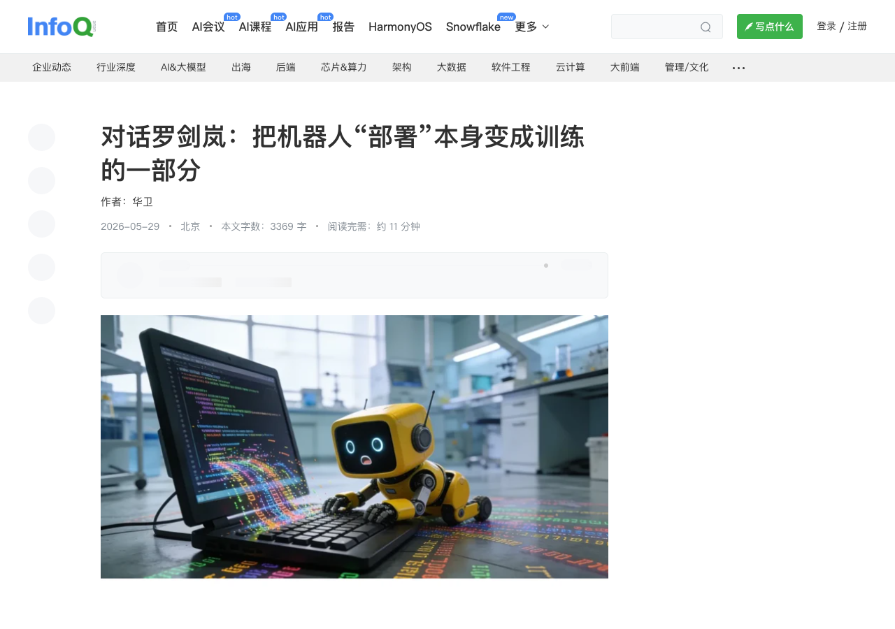

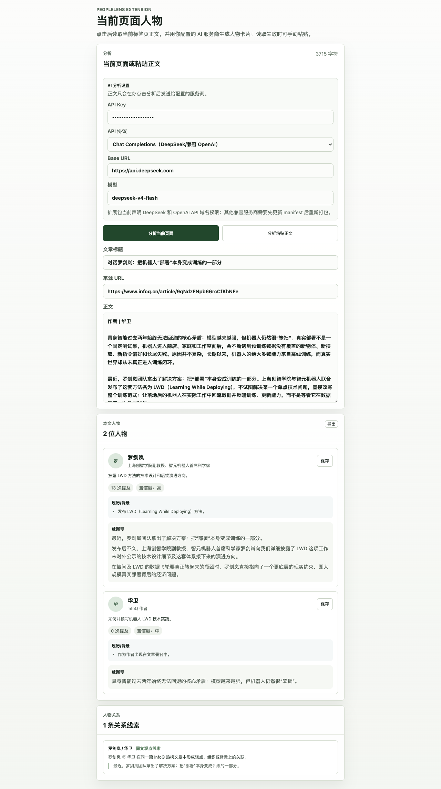

### 18. GitHub 面临生存之战！多位员工曝内部乱象：独立文化要没了，封杀 Claude Code 才能“活”

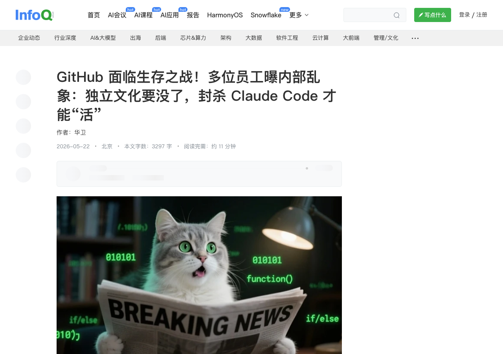

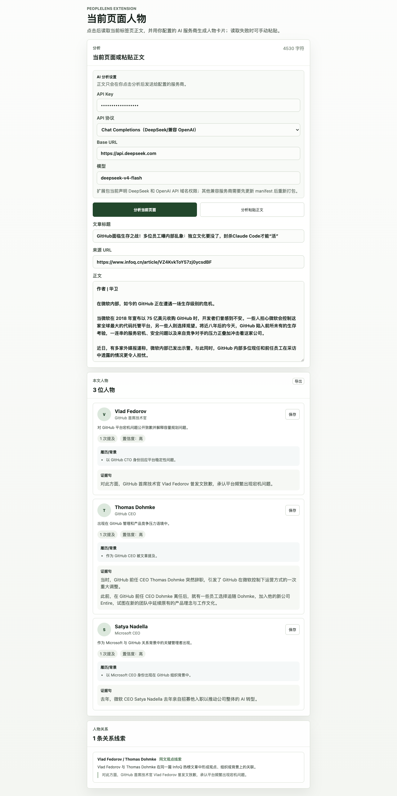

### 失败保留旧结果

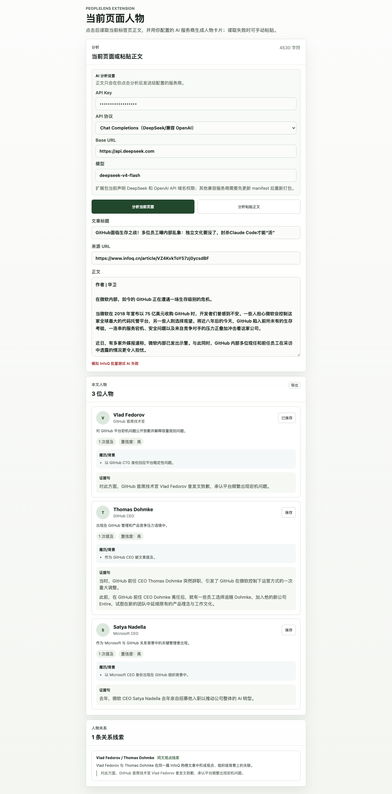

## 风险与限制

- 没有使用真实 AI provider，因此不能把本报告作为模型抽取准确率验收。
- InfoQ 页面含活动横幅和站点导航，本测试保留这些真实页面噪声以贴近扩展实际输入。
- 当前批量测试覆盖“粘贴正文”路径；“分析当前页面”路径由既有 `e2e:extension:chromium` harness 覆盖。
